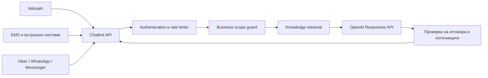

# Chatbot

Централизирана AI API услуга за бизнес въпроси, свързани с България.

Проектът има за цел да предоставя един надежден асистент, който може да бъде използван от различни платформи — уебсайтове, вътрешни системи, EMS, Viber, WhatsApp, Messenger и други канали. Знанията, правилата и историята се управляват на едно място, а всяка платформа използва един и същ API.

> **Статус:** Начална продуктова и техническа спецификация. Реализацията на първия работещ вертикален разрез предстои.

## Основни принципи

- Един централен API, независим от конкретна клиентска платформа.
- Отговори само по бизнес теми и ясно отклоняване на въпроси извън обхвата.
- Актуализируема база знания вместо обучение на модела с променливи факти.
- Цитирани източници и дата на актуалност при фактически отговори.
- Ясно разграничаване между нормативен текст, административно становище и практическа насока.
- Без измисляне на отговор, когато липсва достатъчно надеждна информация.
- Защита на личните данни, проследимост и човешка ескалация при рискови казуси.

## Предвиден обхват

Асистентът ще обслужва въпроси в области като:

- счетоводство и финансово отчитане;
- ЗДДС, OSS и трансгранични доставки;
- корпоративно и лично данъчно облагане;
- трудови правоотношения и работна заплата;
- социално и здравно осигуряване;
- фирмена регистрация и административни процедури;
- работа с НАП, НОИ, НСИ, ГИТ и други институции;
- общо управление и организация на бизнес в България.

Въпросите извън разрешения бизнес обхват ще получават кратък и предвидим отказ. Проверката за тематичен обхват е отделна от стандартната проверка за опасно или неподходящо съдържание.

## Архитектура



Планираната технологична основа е:

- Node.js и TypeScript;
- Fastify като лек HTTP framework;
- официалният OpenAI SDK и Responses API;
- OpenAI File Search и vector stores за първата версия на базата знания;
- Zod за валидация и structured outputs;
- OpenAPI/Swagger документация;
- Vitest за автоматични тестове;
- Supervisor и Nginx при deployment чрез Laravel Forge.

Архитектурата ще използва интерфейси за AI provider, knowledge provider и conversation store. Това позволява по-късно да бъдат сменяни отделни компоненти, без да се променя публичният API.

## Планиран API договор

### Health check

```http
GET /health
```

### Изпращане на съобщение

```http
POST /v1/chat
Authorization: Bearer <platform-api-key>
Content-Type: application/json
```

Примерна заявка:

```json
{
  "channel": "ems",
  "externalUserId": "user-123",
  "conversationId": "conversation-456",
  "message": "Какъв е срокът за подаване на VIES декларация?"
}
```

Примерен отговор:

```json
{
  "answer": "...",
  "conversationId": "conversation-456",
  "inScope": true,
  "asOf": "2026-08-13",
  "sources": [
    {
      "title": "Закон за данък върху добавената стойност",
      "url": "https://example.com/source",
      "validFrom": "2026-01-01"
    }
  ]
}
```

Полето `channel` служи за проследимост и адаптиране на формата, но бизнес логиката няма да бъде обвързана с конкретен канал.

## База знания

Документите няма да се съхраняват като неструктурирана купчина файлове. Всеки източник следва да има метаданни като:

- заглавие и категория;
- издател или институция;
- URL или оригинален файл;
- дата на публикуване;
- `validFrom` и `validTo`;
- версия;
- вид на източника;
- публично или вътрешно ниво на достъп.

Променливите факти ще се поддържат чрез retrieval, а не чрез fine-tuning. Fine-tuning може да бъде разглеждан по-късно само за устойчив стил или специализиран формат на отговорите.

## Сигурност

- OpenAI и платформените ключове никога не се записват в Git.
- Всяка платформа получава отделен API ключ, който може да бъде отнет независимо.
- Входът се валидира и ограничава по размер и честота.
- Логовете не трябва да съдържат ключове, ЕГН или други чувствителни данни.
- Достъпът до вътрешни източници се проверява преди retrieval.
- Рисковите данъчни, правни и трудови казуси могат да се прехвърлят към човек.

## Конфигурация

Очакваните production променливи ще бъдат документирани в `.env.example`. Планираният минимален набор е:

```dotenv
NODE_ENV=production
HOST=127.0.0.1
PORT=3000
TRUST_PROXY=true

OPENAI_API_KEY=
OPENAI_MODEL=
OPENAI_VECTOR_STORE_ID=

CHATBOT_API_KEYS=
CORS_ORIGINS=
```

Реалният `.env` остава само в защитената среда на сървъра.

## Deployment чрез Laravel Forge

Услугата е предвидена да работи на DigitalOcean сървър, управляван чрез Laravel Forge:

1. Forge клонира `main` от GitHub.
2. Deploy script изпълнява `npm ci`, тестовете и production build.
3. Supervisor поддържа Node.js процеса активен.
4. Nginx приема HTTPS заявките и ги препраща към `127.0.0.1:3000`.
5. Forge проверява `/health` след deployment.

Портът на Fastify няма да бъде публично достъпен. Външният трафик ще преминава единствено през Nginx и валиден TLS сертификат.

## Пътна карта

- [ ] Основа на TypeScript/Fastify приложението.
- [ ] Health endpoint и OpenAPI документация.
- [ ] Bearer authentication и rate limiting.
- [ ] Business scope classifier със structured output.
- [ ] OpenAI Responses API provider.
- [ ] Fake provider за тестове без реален API ключ.
- [ ] File Search/vector store интеграция.
- [ ] Цитирани източници в отговорите.
- [ ] Постоянно съхранение на разговорите.
- [ ] Forge deploy script, Supervisor и Nginx конфигурация.
- [ ] Първи адаптер за EMS.
- [ ] Уеб чат и допълнителни messaging канали.
- [ ] Набор от eval тестове за български бизнес въпроси.

## Развитие на продукта

README файлът служи като начална спецификация и ще се обновява заедно с продукта. Новите бизнес изисквания първо трябва да бъдат описани като проверимо поведение, след което да бъдат реализирани и покрити с тестове.

