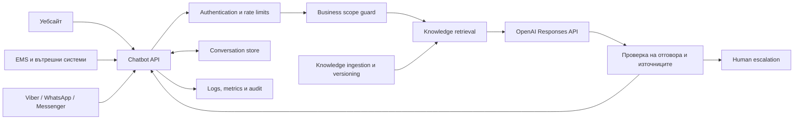

# Chatbot

Централизирана AI API услуга за бизнес въпроси, свързани с България.

Проектът има за цел да предоставя един надежден асистент, който може да бъде използван от различни платформи — уебсайтове, вътрешни системи, EMS, Viber, WhatsApp, Messenger и други канали. Знанията, правилата и историята се управляват на едно място, а всяка платформа използва един и същ API.

> **Статус:** Начална продуктова и техническа спецификация. Реализацията на първия работещ вертикален разрез предстои.

## Основни принципи

- Един централен API, независим от конкретна клиентска платформа.
- Отговори само по бизнес теми и ясно отклоняване на въпроси извън обхвата.
- Актуализируема база знания вместо обучение на модела с променливи факти.
- Цитирани източници и дата на актуалност при фактически отговори.
- Ясно разграничаване между нормативен текст, административно становище и практическа насока.
- Без измисляне на отговор, когато липсва достатъчно надеждна информация.
- Защита на личните данни, проследимост и човешка ескалация при рискови казуси.

## Предвиден обхват

Асистентът ще обслужва въпроси в области като:

- счетоводство и финансово отчитане;
- ЗДДС, OSS и трансгранични доставки;
- корпоративно и лично данъчно облагане;
- трудови правоотношения и работна заплата;
- социално и здравно осигуряване;
- фирмена регистрация и административни процедури;
- работа с НАП, НОИ, НСИ, ГИТ и други институции;
- общо управление и организация на бизнес в България.

Въпросите извън разрешения бизнес обхват ще получават кратък и предвидим отказ. Проверката за тематичен обхват е отделна от стандартната проверка за опасно или неподходящо съдържание.

## Архитектура



Планираната технологична основа е:

- Node.js и TypeScript;
- Fastify като лек HTTP framework;
- официалният OpenAI SDK и Responses API;
- OpenAI File Search и vector stores за първата версия на базата знания;
- Zod за валидация и structured outputs;
- OpenAPI/Swagger документация;
- Vitest за автоматични тестове;
- Supervisor и Nginx при deployment чрез Laravel Forge.

Архитектурата ще използва интерфейси за AI provider, knowledge provider и conversation store. Това позволява по-късно да бъдат сменяни отделни компоненти, без да се променя публичният API.

## Първи работещ вертикален разрез

Първата версия се счита за завършена, когато:

- `POST /v1/chat` работи с реален OpenAI provider и с fake provider за автоматични тестове;
- всяка заявка се удостоверява, валидира и получава уникален `requestId`;
- асистентът различава въпроси в обхвата, извън обхвата и въпроси, които изискват уточнение;
- фактически отговор се връща само когато има достатъчно надеждни и валидни източници;
- при недостатъчни или противоречиви данни асистентът не предполага отговор;
- отговорът съдържа състояние, дата на валидност, използвани източници и предупреждения;
- разговорите са изолирани по клиент и не се записват чувствителни данни в логовете;
- основните успешни, отказани и грешни сценарии са покрити с API и eval тестове;
- production build може да бъде инсталиран и проверен чрез Forge deployment процеса.

## Планиран API договор

### Health check

```http
GET /health
```

### Изпращане на съобщение

```http
POST /v1/chat
Authorization: Bearer <platform-api-key>
Content-Type: application/json
```

Примерна заявка:

```json
{
  "tenantId": "client-123",
  "channel": "ems",
  "externalUserId": "user-123",
  "conversationId": "conversation-456",
  "message": "Какъв е срокът за подаване на VIES декларация?",
  "context": {
    "jurisdiction": "BG",
    "asOf": "2026-08-13"
  }
}
```

Примерен отговор:

```json
{
  "status": "answered",
  "answer": "...",
  "conversationId": "conversation-456",
  "requestId": "req_01K2...",
  "asOf": "2026-08-13",
  "sources": [
    {
      "title": "Закон за данък върху добавената стойност",
      "url": "https://example.com/source",
      "sourceType": "legislation",
      "validFrom": "2026-01-01",
      "validTo": null,
      "retrievedAt": "2026-08-13T09:30:00Z"
    }
  ],
  "warnings": []
}
```

Полето `tenantId` определя границата за достъп до разговори и вътрешни източници. То се проверява спрямо удостоверения API клиент и не се приема безусловно от заявката. Полето `channel` служи за проследимост и адаптиране на формата, но бизнес логиката няма да бъде обвързана с конкретен канал.

`status` има една от следните стойности:

- `answered` — върнат е отговор с достатъчно надеждни източници;
- `out_of_scope` — въпросът е извън разрешения бизнес обхват;
- `insufficient_evidence` — липсват достатъчни или непротиворечиви източници;
- `needs_clarification` — липсва контекст, необходим за надежден отговор;
- `human_escalation` — казусът следва да бъде прегледан от човек;
- `temporarily_unavailable` — зависима услуга временно не е достъпна.

`asOf` е датата, към която отговорът е валиден. Тя не замества датите на публикуване, извличане и валидност на отделните източници.

### Контекст за отговора

Когато отговорът зависи от обстоятелства като вид лице, регистрация по ДДС, държава, отчетен период, вид правоотношение или дата на събитието, асистентът първо задава уточняващ въпрос. Предположения могат да бъдат използвани само ако са ясно посочени в `warnings` и не променят съществено правния или данъчния резултат.

### Грешки

Всички API грешки използват единен формат:

```json
{
  "error": {
    "code": "RATE_LIMIT_EXCEEDED",
    "message": "Прекалено много заявки.",
    "requestId": "req_01K2..."
  }
}
```

Публичният договор включва поне следните HTTP статуси:

- `400 Bad Request` — невалидна заявка;
- `401 Unauthorized` — липсващ или невалиден API ключ;
- `403 Forbidden` — опит за достъп до чужд tenant или източник;
- `413 Content Too Large` — входът надвишава разрешения размер;
- `429 Too Many Requests` — достигнат rate limit;
- `500 Internal Server Error` — неочаквана вътрешна грешка;
- `503 Service Unavailable` — временен проблем с AI или knowledge provider.

## База знания

Документите няма да се съхраняват като неструктурирана купчина файлове. Всеки източник следва да има метаданни като:

- заглавие и категория;
- издател или институция;
- URL или оригинален файл;
- дата на публикуване;
- `validFrom` и `validTo`;
- версия;
- вид на източника;
- юрисдикция;
- дата на последна проверка или извличане;
- публично или вътрешно ниво на достъп.

### Йерархия на източниците

При оценяване на надеждността се използва следният общ приоритет:

1. нормативен акт и официално обнародван текст;
2. официална информация от компетентна институция;
3. съдебна и административна практика;
4. професионален коментар или специализирана публикация;
5. вътрешна процедура или работна инструкция.

Източник от по-ниско ниво не се представя като равностоен на нормативен текст. При противоречие асистентът посочва различието и не избира мълчаливо удобната интерпретация.

### Достатъчност и валидност

Фактически отговор може да бъде върнат само ако използваните източници са относими към въпроса, приложими към посочения период и достатъчни за извода. В противен случай резултатът е `needs_clarification`, `insufficient_evidence` или `human_escalation`.

Процесът за ingestion трябва да пази версията и произхода на документите, да открива изтекла валидност и да позволява оттегляне на грешен или остарял източник без промяна на приложния код.

Променливите факти ще се поддържат чрез retrieval, а не чрез fine-tuning. Fine-tuning може да бъде разглеждан по-късно само за устойчив стил или специализиран формат на отговорите.

## Сигурност

- OpenAI и платформените ключове никога не се записват в Git.
- Всяка платформа получава отделен API ключ, който може да бъде отнет независимо.
- Входът се валидира и ограничава по размер и честота.
- Логовете не трябва да съдържат ключове, ЕГН или други чувствителни данни.
- Достъпът до вътрешни източници се проверява преди retrieval.
- Рисковите данъчни, правни и трудови казуси могат да се прехвърлят към човек.
- Потребителските съобщения и извлечените документи се третират като недоверено съдържание; инструкции в тях не могат да отменят системните правила или контрола на достъпа.
- Данните, разговорите и вътрешните източници са изолирани по `tenantId`.
- API ключовете се съхраняват като защитени secrets, подлежат на ротация и могат да бъдат отнети без прекъсване за останалите клиенти.

## Разговори, лични данни и човешка ескалация

Постоянното съхранение на разговорите се въвежда само с документирани правила за:

- минималния набор от записвани данни и целта на обработването им;
- маскиране на ЕГН, ключове и други чувствителни стойности преди логване;
- срок за съхранение, изтриване по заявка, архивиране и възстановяване;
- audit trail за достъп до вътрешни източници и човешки преглед;
- отделяне на оперативните логове от съдържанието на разговорите.

Ескалацията към човек се задейства при високорисков казус, противоречиви източници, недостатъчна увереност или изрично искане от потребителя. Предаването трябва да съдържа въпроса, необходимия контекст, използваните източници и причината за ескалация, без излишни лични данни.

## Наблюдаемост и качество

Услугата трябва да предоставя структурирани логове и метрики поне за:

- latency, error rate и наличност;
- брой заявки по tenant и канал;
- разход и използвани tokens;
- retrieval резултати и използвани източници;
- дял на `out_of_scope`, `insufficient_evidence` и `human_escalation` отговорите;
- оценка от автоматичните eval тестове.

Всеки лог и metric event включва `requestId`, но не съдържа пълния потребителски текст по подразбиране. `/health` показва, че процесът работи, а отделна readiness проверка потвърждава дали необходимите зависимости са достъпни.

## Конфигурация

Очакваните production променливи ще бъдат документирани в `.env.example`. Планираният минимален набор е:

```dotenv
NODE_ENV=production
HOST=127.0.0.1
PORT=3000
TRUST_PROXY=true

OPENAI_API_KEY=
OPENAI_MODEL=
OPENAI_VECTOR_STORE_ID=

CHATBOT_API_KEYS=
CORS_ORIGINS=
```

Реалният `.env` остава само в защитената среда на сървъра.

## Deployment чрез Laravel Forge

Услугата е предвидена да работи на DigitalOcean сървър, управляван чрез Laravel Forge:

1. Forge клонира `main` от GitHub.
2. Deploy script изпълнява `npm ci`, тестовете и production build.
3. Supervisor поддържа Node.js процеса активен.
4. Nginx приема HTTPS заявките и ги препраща към `127.0.0.1:3000`.
5. Forge проверява `/health` след deployment.

Портът на Fastify няма да бъде публично достъпен. Външният трафик ще преминава единствено през Nginx и валиден TLS сертификат.

## Пътна карта

- [ ] Основа на TypeScript/Fastify приложението.
- [ ] Health endpoint и OpenAPI документация.
- [ ] Bearer authentication и rate limiting.
- [ ] Tenant isolation и контрол на достъпа до вътрешни източници.
- [ ] Business scope classifier със structured output.
- [ ] OpenAI Responses API provider.
- [ ] Fake provider за тестове без реален API ключ.
- [ ] File Search/vector store интеграция.
- [ ] Knowledge ingestion, versioning и оттегляне на остарели източници.
- [ ] Цитирани източници в отговорите.
- [ ] Постоянно съхранение на разговорите.
- [ ] Human escalation workflow.
- [ ] Структурирани логове, метрики и readiness проверка.
- [ ] Forge deploy script, Supervisor и Nginx конфигурация.
- [ ] Първи адаптер за EMS.
- [ ] Уеб чат и допълнителни messaging канали.
- [ ] Набор от eval тестове за български бизнес въпроси.

## Развитие на продукта

README файлът служи като начална спецификация и ще се обновява заедно с продукта. Новите бизнес изисквания първо трябва да бъдат описани като проверимо поведение, след което да бъдат реализирани и покрити с тестове.

