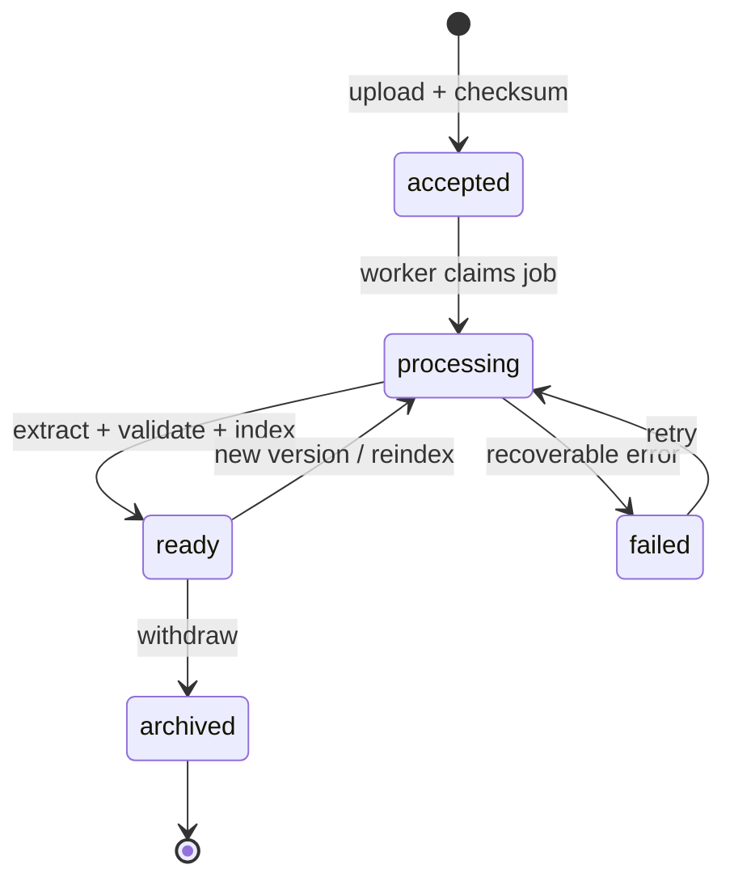

# Knowledge ingestion и разговори

## Решения

- Първи tenant и API клиент: `ems`.
- Основен AI модел: `gpt-5.6-terra` чрез Responses API.
- Knowledge scopes: общ `global` слой и частен `tenant:ems` слой.
- Оригиналните документи са каноничният архив; vector store е производен индекс.
- Metadata и разговорите се пазят в PostgreSQL.
- Съдържанието на съобщенията се криптира с AES-256-GCM преди запис.
- Външният потребителски идентификатор се пази като HMAC-SHA-256 pseudonym.
- Стандартният срок за разговори е 180 дни и може да се настройва по tenant.
- Human escalation се предава към EMS. След предаването копието в EMS следва политиката на EMS.

## Източници за нормативна информация

Източниците се записват с произход, версия, период на валидност и дата на проверка.

1. [Държавен вестник](https://dv.parliament.bg/) — официална публикационна следа.
2. [Народно събрание](https://www.parliament.bg/bg/laws) — приети текстове и законодателна история.
3. Официалният сайт на компетентната институция — административни указания и тематични материали.
4. [EUR-Lex](https://eur-lex.europa.eu/) — право на Европейския съюз.

Консолидираните текстове се третират като производни. За всеки консолидиран закон се пази manifest на използваните броеве на „Държавен вестник“ и резултат от последната проверка.

## Document lifecycle

Upload API приема оригиналния файл и metadata. Следващият worker слой трябва да:

1. провери MIME type, размер, checksum и malware status;
2. извлече текста и структурата без да изпълнява инструкции от документа;
3. валидира задължителните metadata и времевата приложимост;
4. създаде версия и audit event;
5. добави производния файл във vector store с filterable attributes;
6. отбележи документа като `ready` само след успешно индексиране.

OpenAI vector-store файловете имат собствен асинхронен status. Изтриването на vector-store запис не изтрива автоматично оригиналния OpenAI File, затова cleanup процесът трябва да управлява двата ресурса отделно.

## Разговори

PostgreSQL пази conversation metadata и криптирани user/assistant messages. Оперативните логове съдържат `requestId`, tenant, timing и status, но не съдържат текста на съобщенията.

Почистването на изтекли разговори се изпълнява от защитена периодична задача. Анонимизирани агрегирани метрики могат да останат след изтриването, ако не позволяват възстановяване на съдържанието или идентифициране на потребител.

## Production storage

Текущият adapter пази суровите файлове в `DATA_DIR` за локално развитие. Преди production deployment трябва да бъде заменен с private S3-compatible object storage, например DigitalOcean Spaces, с versioning, encryption, lifecycle policy и отделни credentials за worker процеса.
